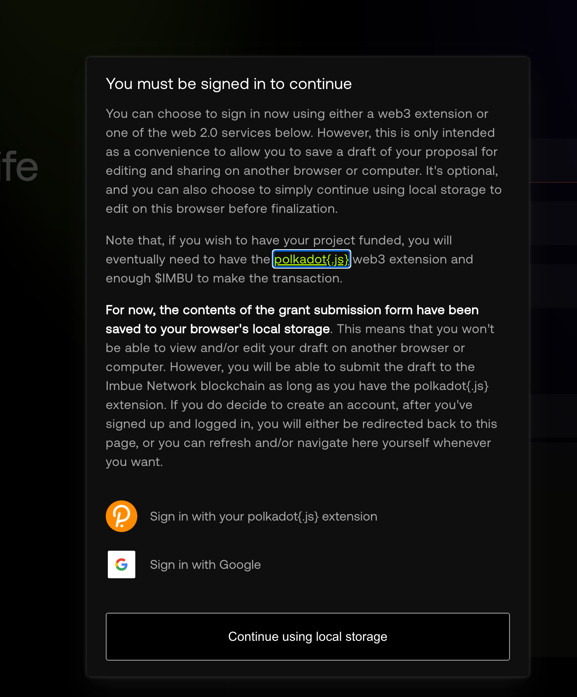
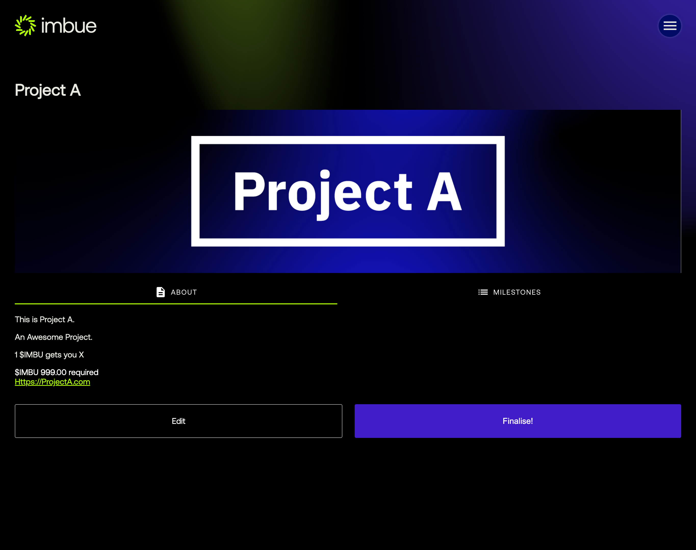
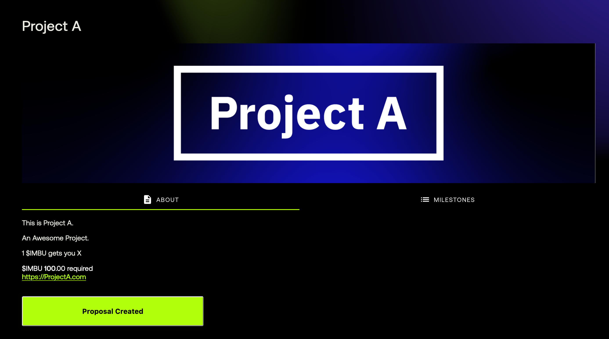
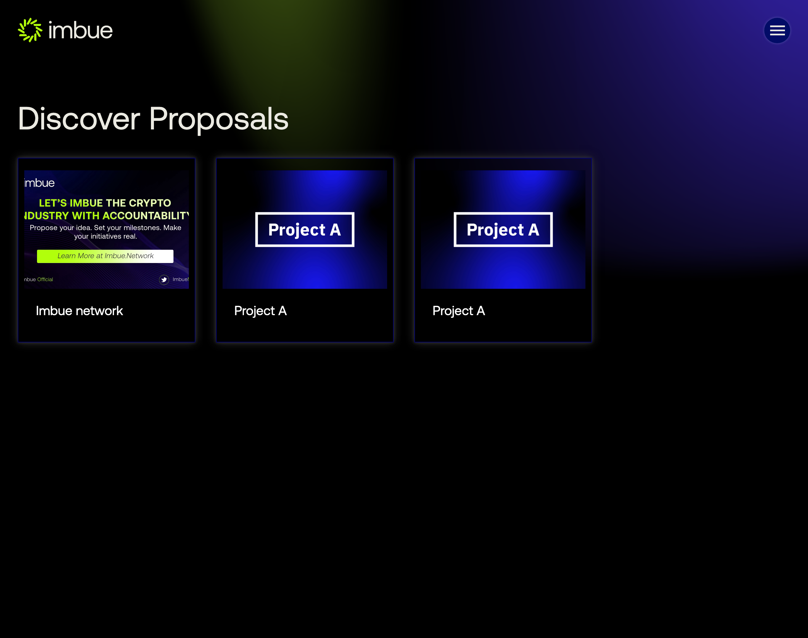
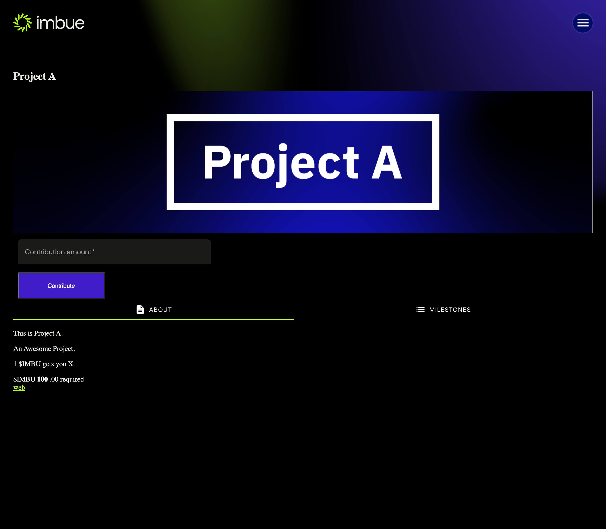
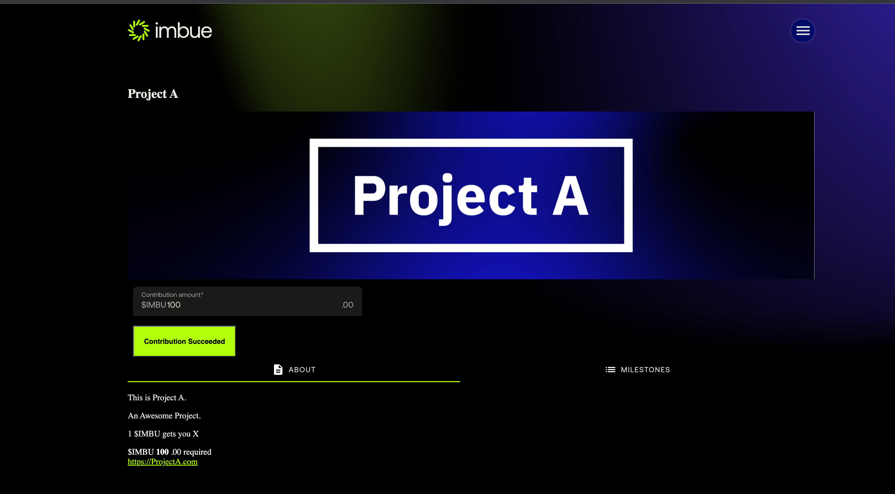
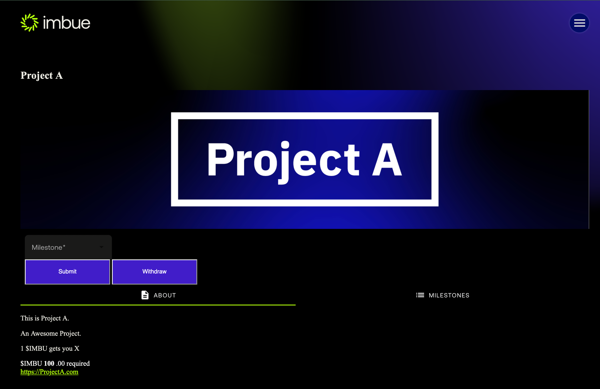
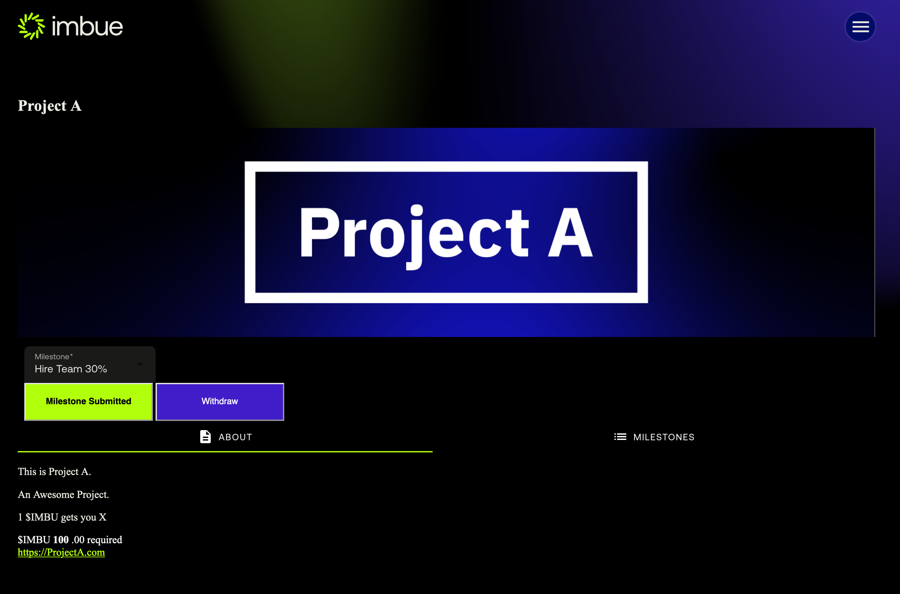
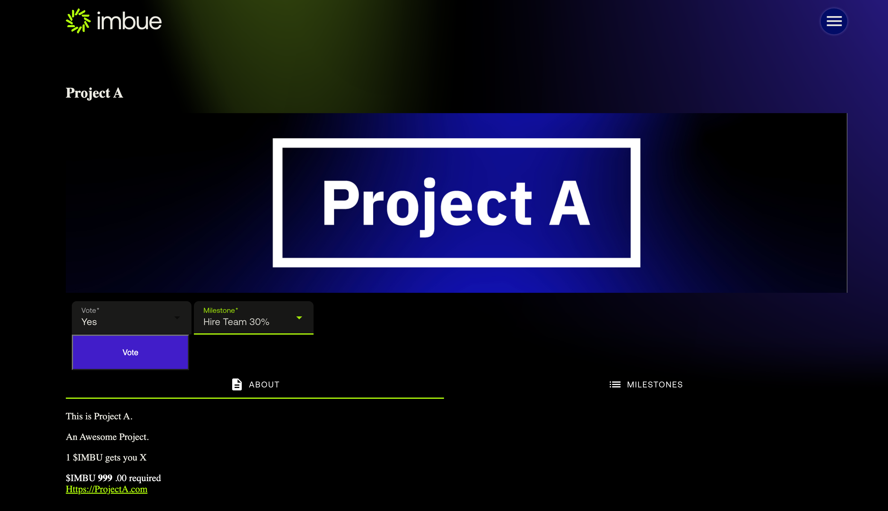
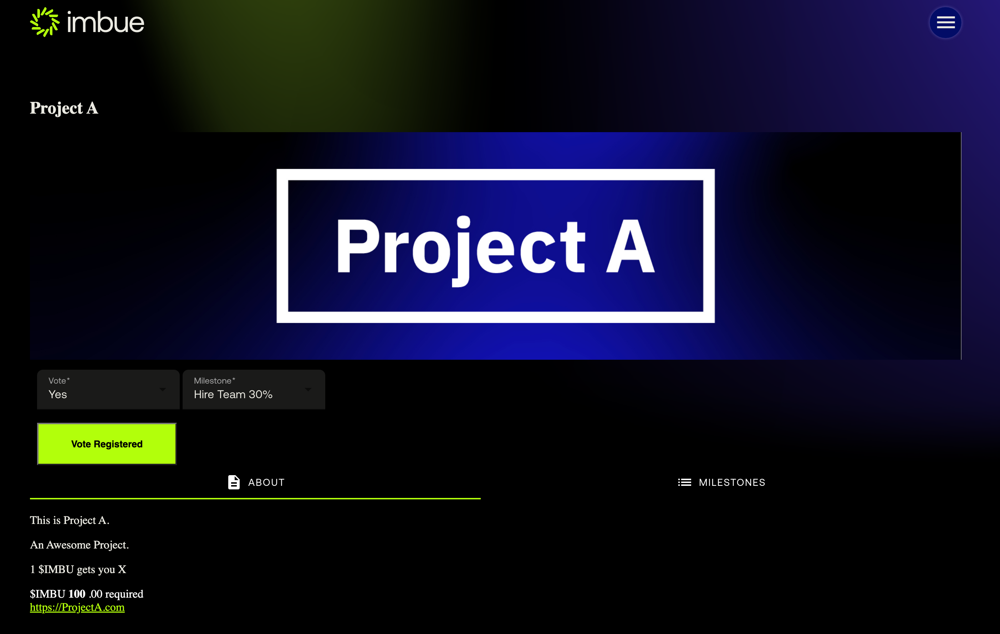

<a href="https://github.com/w3f/Grants-Program/pull/703"></a>
Imbue Network is a decentralised crowdfunding DAO built on top of the Polkadot blockchain platform. It is an idea incubator open to the entire world that allows anyone, from any walk of life and for any kind of endeavour, to submit and vote on Ideas worth funding from the communities that believe in them the most.


# Imbue Network Dapp

## Requirements

To go through this guide you will need:

1. An account on the target testnet with funds. Our public testnet can be found [here](https://polkadot.js.org/apps/?rpc=wss%3A%2F%2Ftestnet.imbue.network#/explorer)
2. Polkadot-js wallet extention, you can install one from [here](https://polkadot.js.org/extension/)
3. If launching locally, you need to have the env `GOOGLE_OAUTH2_CLIENT_ID` and `GOOGLE_OAUTH2_CLIENT_SECRET` variables set. You can set an empty value to them if you dont plan to sign in using OAuth


## Local deployment quickstart with docker-compose

From the top-level of the repo.

1. Add some env variables to your bash profile.
```bash
echo 'IMBUE_NETWORK_WEBSOCK_ADDR="wss://rococo.imbue.network"' >> $HOME/.bashrc;
echo 'RELAY_CHAIN_WEBSOCK_ADDR="wss://rococo-rpc.polkadot.io"' >> $HOME/.bashrc;
```

2. Then build the associated images 
```bash
docker-compose up -d;
```

3. Setup DB and install.
```bash
cd api;
make db_up;
```

4. Finally to start the project, simply
```bash
yarn start;
```

If you face any issues after the databases are created then restart the services from the top level repo. 
```bash
docker-compose down;
docker-compose up -d 
``` 


_Please note if you are using a Apple silicon e.g. M1 then you need to replace the Docker files_


## Steps to create a new Imbue Network Project

For the purpose of this tutorial we will be using a local environment but you can just as easily follow it by going to the public staging url https://dev.imbue.network/dapp

We also advise to use two completely different browsers (e.g. Chrome and Firefox) because you will be effectively using two different personas


### _(Initiator)_ Create the proposal 
1. Navigate to http://localhost:8081/dapp/proposals/draft
2. The site will ask you to connect to your wallet, chose the required account who will act as the initiator for this project.

3. Enter all of the required information for the project and the required funds. Add at least one milestone. The "percent to unlock" for all of the milestones should add up to 100%.

4. Click "Save Draft Proposal Proposal" to start the process of submitting the transaction to the chain.
5. Review the project and if acceptable click on `Finalise!`

6. Once you see the `Proposal Created` message, congratulations your proposal is now onchain!



### _(ADMIN/COUNCIL)_ Schedule round
1. The UI for a super user has not been built yet, but you can use polkadotJS to open the funding round, its fairly simple and can be followed [here](https://github.com/ImbueNetwork/imbue#proposal-pallet-interaction)


### _(Contributor)_ Contribute
1. To contribute you need to ensure you are using a different browser or incognito because initators of projects cannot contribute to their own projects
2. Navigate to http://localhost:8081/dapp/proposals/
3. You should the project see a list of projects that have been created via the UI

4. Click the project you want to fund and you will be navigated to the details page. Notice that contribution section will now be available

Enter the amount you want to contribute and click the `Contribute` button



### _(ADMIN/COUNCIL)_ Approve Project
1. The UI for a super user has not been built yet, but you can use polkadotJS to approve a project [here](https://github.com/ImbueNetwork/imbue#proposal-pallet-interaction)

_Please note the role of the council here to define what success looks like, answer questions around whether of not a fund raise can be considered successful if it only hit 70% or 80% of its target. The role of the council will be reduced once these thresholds are set_


### _(Initiator)_ Submit Milestone
1. Once a project has been approved, switch back to the initator - go to the details page and you will see that it has changed to reflect milestone submission


2. Once the submission gets saved onchain, you should see confirmation of it
 and submit your first milestone.
 


### _(Contributor)_  Vote On Milestone
1. Switch back to the contributor and you will see that you can now vote on the milestone


2. Choose your vote and the milestone you want to vote on, and click vote. Once the vote gets saved on chain you should see the confirmation



### _(ADMIN/COUNCIL)_ Approve Milestone
1. The UI for a super user has not been built yet, but you can use polkadotJS to approve a milestone [here](https://github.com/ImbueNetwork/imbue#proposal-pallet-interaction)

_Please note just like the funding decision, the council comes in here to define what a successful vote looks like. This is a form of protection while we work with the community build the foundations of what success looks like. Once thresholds are set we can reduce the role of the council_

### _(Initiator)_ Withdraw Funds
1. Switch back to the initator and now you can successfully withdraw the funds


## Services

- The "web" service is an nginx container that `proxy_pass`es most requests to the webflow server, except for `location /dist`
- The "api" service is a nodejs/express app configured to use dynamodb local storage.
- The "dynamodb-local" service is a temporary sqlite-based dynamodb interface to stand in for an eventual AWS hosted version of the same.
- The "imbue" service is a rococo-local test network (currently disabled in the docker-compose config)

The repo is split into `api` and `web` directories. In each of those, you will find a `Dockerfile`. To run the api without docker, use its Dockerfile as a guide.

To develop the website locally, using `yarn` run 

```bash
yarn install
```
to install dependencies, and 

```bash
yarn start
```

which starts webpack in "watch" mode. This is connected to the running nginx server via the docker-compose `volumes` directive, which is tied to the `./web/dist` directory (where webpack outputs its bundle).
